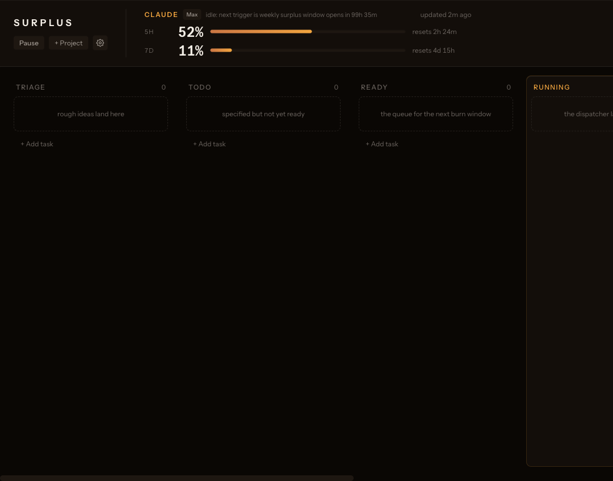
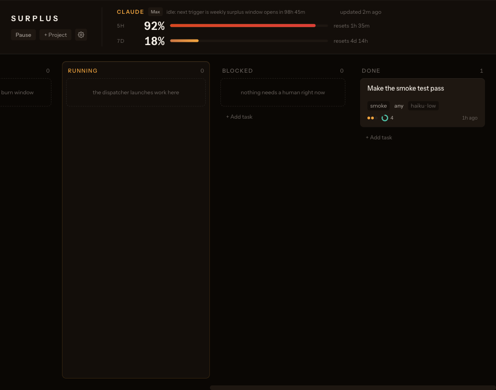
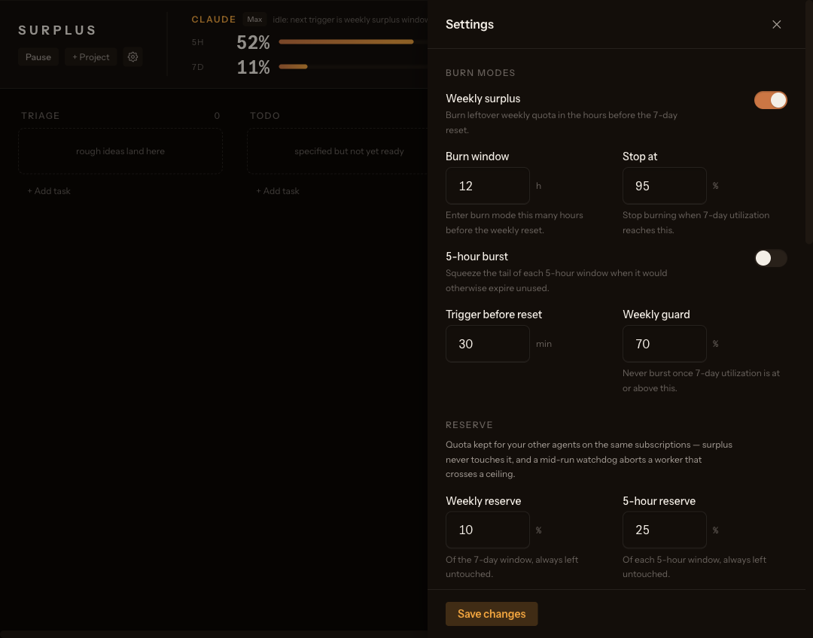

# surplus

**Your Claude/ChatGPT subscription quota resets every week — whatever you
didn't use is gone. surplus spends those expiring tokens on your backlog
while you sleep.**

It's a local macOS tool: a kanban board of tasks for your own projects, a
watcher that knows when each provider's weekly reset is coming, and a
dispatcher that — in the final hours before reset — runs autonomous Claude
Code / Codex sessions in isolated git worktrees, has an LLM judge score the
work against your project's VISION, and leaves reviewed-ready branches behind.

## Get started in 4 steps

You don't need to be a programmer. If you have a Claude subscription and can
copy-paste three commands, you can use this.

**Before you start, you need** (one-time, ~5 minutes):

- a Mac
- [Claude Code](https://claude.com/claude-code) installed and logged in with
  your Pro/Max account (if typing `claude` in Terminal opens a chat, you're
  set)
- [Node.js](https://nodejs.org) 20+ and pnpm (`npm install -g pnpm`)

### 1 · Install

Copy-paste into Terminal:

```sh
git clone https://github.com/wiziswiz/surplus.git && cd surplus
pnpm install && pnpm build:all
npm link    # makes the `surplus` command available everywhere
```

### 2 · Open the board and pick a project

```sh
surplus board
```

Your dashboard is now at [http://localhost:4242](http://localhost:4242):



Click **+ Project**. surplus scans your `~/Projects` folder and shows your
repos sorted by recent activity — projects you've recently opened in Claude
Code get a `recent` badge. **Click one. That's it** — no paths to find, no
typing. (Keep your code somewhere else? Add scan folders in Settings →
Discovery, or use the "Paste a path" tab. No projects at all? "New project"
creates one from scratch.)

Picking a project auto-drafts a `VISION.md` — a plain-English description of
what "finished" looks like for that project. Worth a read and an edit: it's
the contract your overnight workers are graded against.

### 3 · Queue some work

Click **+ Add task** in the Ready column and describe what you want done, in
plain English, like you'd brief a contractor: *"Add CSV export to the reports
page. It should export the currently filtered rows with correct headers."*

### 4 · Arm the schedule

```sh
surplus install
```

Done. surplus now checks your usage every 15 minutes and does **nothing**
until the final hours before your weekly reset — the window where unused
quota is about to evaporate anyway. Then it works through your queue:
each task runs in its own git branch, an independent LLM judge scores the
result against your VISION (pass = done, fail = retry with feedback), and
you wake up to cards in Done with reviewed-ready branches:



Everything is tunable from the Settings panel — burn windows, safety
reserves for your other tools, models, budgets:



<details>
<summary><b>Prefer the terminal?</b> Every board action has a CLI equivalent.</summary>

```sh
surplus add ~/Projects/my-backlog-app      # register a project
surplus task create my-backlog-app "Add CSV export to reports" \
  --body "Export currently filtered rows. Acceptance: file opens with correct headers."
surplus status                             # usage windows + decision per provider
surplus burn --force                       # force one task through right now
surplus pause                              # kill switch
```

Nothing runs until a burn window opens. `burn --force` ignores the windows
but still respects pacing and the kill switch.

</details>

## What & why

The idea went viral as a cron job (@aaronjmars's tweet and his `aeon` repo):
fire a Claude Code session at the end of every 5-hour window so no window
goes unused. It works, but it has a flaw — every burst also draws down the
*7-day* window, so the cron torches the weekly limit you actually need during
the day. By midweek your "free" usage has eaten your real usage.

surplus inverts it: the default mode burns **only use-it-or-lose-it quota** —
the leftover 7-day budget in the final hours before the weekly reset, stopping
at a configurable utilization target. A 5-hour-burst mode in the original
spirit exists but ships disabled, and even when enabled refuses to burst once
weekly utilization crosses a guard threshold.

Credit where due:

- **@aaronjmars** — the tweet and `aeon`, the proof that idle subscription
  quota is a schedulable resource.
- **karpathy's autoresearch** — the `program.md` pattern: a per-project
  charter the agent re-reads every session. surplus calls it `VISION.md`.
- **Claude Code `/goal`** — the outer evaluator loop the claude worker runs
  inside.
- **RULER-style LLM-as-judge** — an independent model scores each run against
  the project's criteria instead of trusting the worker's self-report.
- **Hermes** — the kanban-board-as-agent-interface idea behind the local
  board.

## How it works

```
 launchd (StartInterval 900)            any scheduler works — see adapters/
        |
        v
  surplus tick (idempotent)
        |
        v
  per-provider usage probe        claude: GET api.anthropic.com/api/oauth/usage
   (claude, codex)                codex:  CLI probe, or weeklyResetFallback
        |
        v
  decision engine (pure)          -> idle | burn | pace-wait | stop
        |
        | burn
        v
  dispatcher                      claims highest-priority 'ready' task whose
        |                         provider affinity matches the burning provider
        v
  work session                    git worktree, branch surplus/<task-id>
   claude -p "/goal ..."          (claude)
   codex exec                     (codex)
        |
        v
  judge (always claude)           scores 1-5 against VISION criteria;
        |                         pass -> done, fail -> requeue with feedback,
        v                         maxAttempts -> blocked
  board (localhost)               kanban + live run/judge events (SSE)
```

Two modes, evaluated per provider on every tick:

- **weeklySurplus** (default ON): when `now >= sevenDayResetsAt -
  burnWindowHours`, start burning; stop when 7-day utilization reaches
  `stopAtPct` (default 95). This is the only mode that can't cost you
  anything — the quota was expiring anyway.
- **fiveHourBurst** (default OFF): when fewer than
  `triggerMinutesBeforeReset` minutes remain in the 5-hour window, burst —
  but never when 7-day utilization is at or above `weeklyGuardPct` (default
  70). This is the aaron-style mode, weekly-guarded.

Between task launches, pacing applies in both modes: if 5-hour utilization is
at or above `pacing.fiveHourPausePct` (default 90), the dispatcher waits for
the 5-hour reset instead of slamming into the rate limit mid-run.

Failed runs aren't discarded: the judge's "what's missing" feedback is
stored on the task and prepended to the next attempt, so retries converge
instead of repeating. For codex — which has no `/goal` outer loop — this
judge → requeue cycle *is* the outer loop.

## Two providers

| | claude | codex |
|---|---|---|
| Enabled | by default | `providers.codex.enabled: true` |
| Usage source | OAuth usage endpoint (automatic) | CLI probe when available, else `weeklyResetFallback` |
| Worker | `claude -p "/goal ..."` | `codex exec` |
| Outer loop | `/goal` evaluator in-session | judge → requeue across sessions |
| Judge | claude | claude (judges both providers' work) |

**claude** is fully automatic: surplus reads your Claude Code OAuth token
(Keychain or `~/.claude/.credentials.json`), hits the usage endpoint, and
gets live 5h/7d utilization and reset times.

**codex** usage discovery depends on what your installed Codex CLI exposes —
see [`adapters/codex-notes.md`](adapters/codex-notes.md) for the current
probing details. When live usage isn't discoverable, set
`providers.codex.weeklyResetFallback` to a known weekly reset (an ISO
timestamp, or `'Thu 21:00'`-style weekday + time); surplus extrapolates the
7-day window from it and burns time-gated, treating utilization as unknown.

Projects and tasks carry a provider affinity — `claude`, `codex`, or `any`
(the default). When a burn window opens for a provider, the dispatcher only
claims tasks whose affinity matches. `any` tasks go to whichever provider is
burning, so a single backlog drains both subscriptions.

## The usage-endpoint gotcha

`GET https://api.anthropic.com/api/oauth/usage` is the endpoint that knows
your subscription windows, and it authenticates with the **Claude Code OAuth
access token** — the one that starts with `sk-ant-oat01-...` — not an
Anthropic API key.

If you've seen this fail with 401/404 (as half the replies to the original
thread did): you were sending an API key (`sk-ant-api...`). API keys belong
to the metered API and know nothing about your Pro/Max subscription windows;
the OAuth token is what Claude Code itself uses.

surplus reads the token automatically from the macOS Keychain (where Claude
Code stores it) or from `~/.claude/.credentials.json`. You never paste it
anywhere, and surplus never logs, prints, or stores it — errors that involve
the token are redacted.

## Writing VISION.md

Each registered project gets a `VISION.md` (template in
[`templates/VISION.md`](templates/VISION.md)) — the autoresearch `program.md`
idea: a charter the worker re-reads every session and the judge scores
against. It has five sections plus optional frontmatter
(`provider` / `model` / `effort` overrides):

- **Vision** — one paragraph describing the *finished* state, written as
  something verifiable, not a wish.
- **Acceptance criteria** — the contract. Each item must be **checkable**:
  demonstrable from command output or a UI walkthrough. "Users can filter
  reports by date and the filter persists across reload" is checkable;
  "filtering feels fast" is not.
- **Verify commands** — shell commands that **must exit 0** when the criteria
  hold (`pnpm test`, `pnpm build`, a smoke script). The worker runs them; the
  `/goal` evaluator and the judge read the results. If you can't write a
  verify command for a criterion, the judge can't score it and the worker
  can't know it's done — rewrite the criterion.
- **UI flows** — for projects with a UI: flows to walk through as a real user
  before claiming done.
- **Guardrails** — hard constraints: files not to touch, behavior to
  preserve, dependencies not to add.

Weak VISION.md files produce weak runs. The judge is only as good as the
criteria you give it.

## Model & effort resolution

Both `model` and `effort` resolve independently through the same precedence
chain — first non-null wins:

```
task  >  VISION.md frontmatter  >  project  >  config provider defaults
```

| Where | Key | Example |
|---|---|---|
| Task | `task create ... --model opus --effort max` | one-off heavy task |
| VISION frontmatter | `model: sonnet` / `effort: high` | per-project charter |
| Project | `surplus add ... --model haiku` | stored on the project row |
| Config | `providers.<p>.defaults.model` / `.effort` | global fallback |

Claude models: `opus` \| `sonnet` \| `haiku`; claude effort: `low` \|
`medium` \| `high` \| `xhigh` \| `max`. Codex takes its own model ids (e.g.
`gpt-5.1-codex`) and reasoning-effort strings. The judge model is configured
separately (`judge.model`) and always runs on claude.

## Safety

- **Branches only, never pushes.** Work happens in a git worktree under
  `~/.surplus/worktrees/<task-id>` on a `surplus/<task-id>` branch. Merging
  is yours to do, after reading the diff.
- **No bypass modes.** The claude worker runs with permission-mode
  `acceptEdits` plus an explicit tool allowlist (with `git push` denied);
  the codex worker runs inside codex's sandbox. surplus never passes
  skip-permissions / bypass flags.
- **Kill switch.** `surplus pause` creates `~/.surplus/PAUSED`; every tick
  then decides `stop` until `surplus resume`. Deleting the file by hand works
  too.
- **Respawn guard + concurrency cap.** Ticks that fire while a run is in
  flight are no-ops past `dispatcher.maxConcurrent` (default 1); a task that
  fails `maxAttempts` times is blocked, not retried forever.
- **Timeouts.** Every run has a hard wall-clock cap
  (`dispatcher.taskTimeoutMinutes`, default 90) and a suggested turn bound in
  the goal condition.
- **Localhost-only board.** The board binds to localhost; there is no remote
  surface.
- **Tokens never logged.** The OAuth token is read at call time, held in
  memory, and redacted from any error text. Nothing secret is written to
  `~/.surplus` or the repo.

## Sharing the subscription with other agents

If always-on assistants (OpenClaw, Hermes, scheduled Claude/Codex crons) run
on the same subscriptions, a naive burner would starve them right when it
"wins." surplus treats part of every window as a protected **reserve**:

```jsonc
"reserve": {
  "weeklyPct": 10,          // never burn the last 10% of the 7-day window
  "fiveHourPct": 25,        // never launch when <25% of the 5h window remains
  "watchdogIntervalMinutes": 5
}
```

The reserve tightens every threshold (effective weekly stop =
`min(stopAtPct, 100 - weeklyPct)`; same for 5h pacing and burst gates), and a
**mid-run watchdog** re-polls usage during long runs — if a ceiling is crossed
mid-run, the worker is terminated (`quota` outcome), the dispatch loop halts,
and your other agents keep their headroom. Defaults leave 10% weekly and 25%
of each 5h window untouched.

## Config reference

`~/.surplus/config.json` — created with defaults on first run. Annotated
example (strip comments; the real file is plain JSON):

```jsonc
{
  "providers": {
    "claude": {
      "enabled": true,
      "defaults": {
        "model": "opus",            // opus | sonnet | haiku
        "effort": "high"            // low | medium | high | xhigh | max
      }
    },
    "codex": {
      "enabled": false,             // opt in to burning ChatGPT quota
      "defaults": {
        "model": "gpt-5.1-codex",   // codex CLI model id
        "effort": "high"            // codex reasoning effort
      },
      // When the codex CLI doesn't expose live usage: a known weekly reset,
      // ISO timestamp or 'Thu 21:00'-style weekday+time. null = no fallback
      // (codex usage unavailable; it won't burn).
      "weeklyResetFallback": null
    }
  },
  "modes": {
    "weeklySurplus": {
      "enabled": true,
      "burnWindowHours": 12,        // start burning this many hours before 7d reset
      "stopAtPct": 95               // stop when 7-day utilization reaches this
    },
    "fiveHourBurst": {
      "enabled": false,             // aaron-style bursts; off by default
      "triggerMinutesBeforeReset": 30,
      "weeklyGuardPct": 70          // never burst at/above this 7-day utilization
    }
  },
  "pacing": {
    "fiveHourPausePct": 90          // between launches, wait for 5h reset above this
  },
  "reserve": {
    "weeklyPct": 10,                // % of the 7-day window always left for other agents
    "fiveHourPct": 25,              // % of the 5h window always left for other agents
    "watchdogIntervalMinutes": 5    // mid-run usage poll cadence
  },
  "dispatcher": {
    "maxConcurrent": 1,             // simultaneous running tasks
    "maxAttempts": 3,               // failures before a task is blocked
    "taskTimeoutMinutes": 90,       // hard wall-clock cap per run
    "maxTurnsHint": 40              // suggested turn bound in the goal condition
  },
  "judge": {
    "model": "haiku"                // judge always runs on claude
  },
  "board": {
    "port": 4242                    // localhost-only kanban board
  },
  "judgePassScore": 4               // judge score (1-5) at/above which a run is done
}
```

Runtime state lives in `~/.surplus/`: `config.json`, `surplus.db` (queue),
`logs/`, `worktrees/`, and the `PAUSED` kill-switch file.

## Schedulers

launchd is the default driver (`surplus install` — see
[`adapters/launchd/`](adapters/launchd/README.md)), but `surplus tick` is an
idempotent CLI and any scheduler can call it. For an OpenClaw cron job and
the agent-fills-the-queue pattern, see
[`adapters/openclaw/`](adapters/openclaw/README.md).
